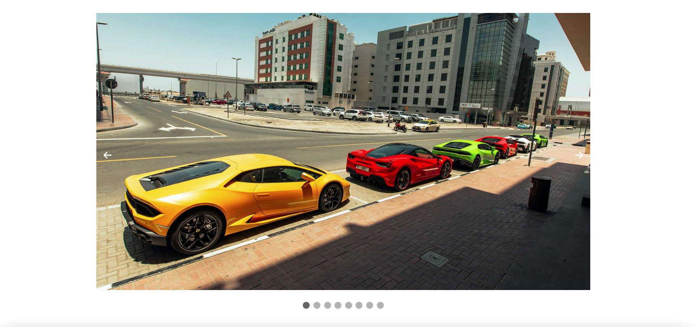

# Image Carousel

A simple, lightweight image carousel built with **HTML**, **CSS**, and **vanilla JavaScript**.
No frameworks, no dependencies — just a clean example of how to build a functional slider from scratch.

## ✨ Features

* Manual navigation (next / previous buttons)
* Smooth CSS transitions
* Fully responsive layout

## 📂 Project Structure

```
├── index.html      # Main page with carousel markup
├── style.css       # Carousel styling
└── script.js       # Carousel functionality
- Assets folder --> Images to add to the carousel
```

## 🚀 How to Use

1. Clone or download the repository.
2. Open `index.html` directly in any modern browser.
3. Add or remove images by editing the HTML or updating the image array (if used).

## 🛠 Customization

Feel free to:

* Adjust transition timing in `style.css`
* Restyle buttons or layout
* Integrate it into your own projects

## Screenshots



## Icons

This project uses **Font Awesome Free** for navigation icons (arrows, etc.).

Font Awesome Free License:
[https://fontawesome.com/license/free](https://fontawesome.com/license/free)

To load the icon set, this CDN link is included in `index.html`:

```html
<link rel="stylesheet" href="https://cdnjs.cloudflare.com/ajax/libs/font-awesome/6.5.1/css/all.min.css">
```

Example usage in the carousel:

```html
<i class="fa-solid fa-arrow-left"></i>
<i class="fa-solid fa-arrow-right"></i>
```

These classes tell Font Awesome which icon to display.

## Images

The images used in this demo are royalty-free tutorial assets. Replace them with your own images if you use this carousel in production. 

## 📄 License

This project is licensed under the MIT License.
You’re free to use it, modify it, and
